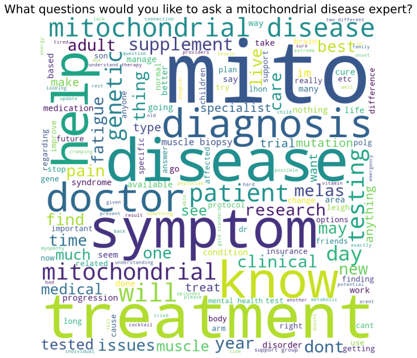

# MitoAction-Survey
MitoAction is a nonprofit organization that advocates and supports people and their families with mitochondrial disease. To gain more information about patients and their families, MitoAction participants completed a survey that included questions about their disease, diagnosis, goodness of life, and thoughts on clinical trials. There were 158 respondents that completed this survey, with the majority being the patient themself.

MitoActions' primary goal for this survey is to identify reasons for the lack of clinical trial participation, as well as recommendations on how to increase trial participation in the future.

The following summarizes key insights derived from Exploratory Data Analysis of nearly 160 survey responses that will support MitoAction's primary goal. The complete analysis and code is in the following [Jupyter Notebook](mtioaction.ipynb).

## Issues With Initial Diagnosis
It is statistically probable to be diagnosed with something else before being correctly diagnosed with mitochondrial disease. 

Patients who were misdiagnosed responded with what they were incorrectly diagnosed with. The word cloud of the responses shows that participants were misdiagnosed with chronic fatigue and fibromyalgia frequently.

In addition, it seems that most survey respondents who were genetically tested to confirm their mitochondrial disease required some form of self advocating to get tested. 

Finally, nearly all patients diagnosed were required to go to a specialized doctor before testing.

**It is easy to empathize with the survey respondents' frustration to get a diagnosis. Upon feeling symptoms, the typical participant is wrongly diagnosed, required in some way to self-advocate for their testing, and then required to go (likely through referral) to a specialist just to get a diagnosis test.**

## What do Participants Want from Clinical Trials?
The top 3 responses participants gave to why they would participate in clinical trials are focused on the positive impact treatments could have on their quality of life.

This is further shown by the participants' responses that treatments for fatigue and muscle weakness should be the focus of clinical trials. The third highest focus is on diagnosis, further supporting what was discussed in the prior section.

Participants were asked what they would most like to ask a mitochondrial expert. Their responses are shown in the following wordcloud. The things that participants most want to learn more about are treatment, symptoms, and diagnosis.

**To get more participants for clinical trials, research organizations need to focus on treating symptoms of mitochondrial disease as well as improving the diagnosis process. Fatigue and muscle weakness should be the symptoms researches are most trying to treat. Finally, clinical trials that are addressing these issues need to be sure that they are clearly communicating these treatments up front.**

## Why is There Low Participation in Clinical Trials?
Participants responded that the main reasons they would NOT participate in clinical trials are fear of side effects, travel requirements to get to the trial, and being unaware of clinical trials.

Participants responded that they learned about clinical trials mainly through their physician, advocacy groups, or just didn’t know about clinical trials.

**Over half of the participants said that they were unaware of clinical trials. Most participants who knew about clinical trials learned about them through physicians or advocacy groups. Physicians and advocacy groups need to remain more up-to-date somehow on current mitochondrial clinical trials so they can share this info with people who have mitochondrial disease. These clinical trials need to the best of their abilities assure participants that there will be minimal side effects (if possible). Or maybe at least the adverse side effects of the trial will likely provide a higher quality of life compared to the nominal symptoms mitochondrial disease patients experience.**

